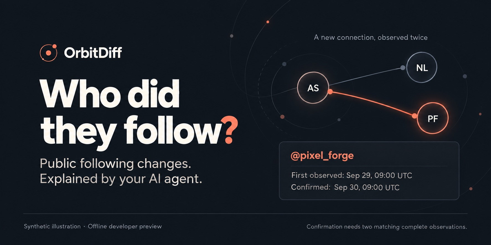

# OrbitDiff

**Who did they follow?**

Curious whether your crush or partner started following someone new on Instagram? OrbitDiff helps your AI agent compare someone's **public following list** over time and show which accounts appeared or disappeared.

See the public handle, when a change was first observed, and when a later observation confirmed it. Those dates describe what OrbitDiff observed, not the exact moment someone tapped Follow. A follow alone does not explain why.



*Synthetic illustration created with ChatGPT Image, not an app screenshot or live result.*

**[Try the offline demo with your agent](docs/prompt.md)**

Start with synthetic data. No Instagram login or personal export is needed. **Developer preview:** live collection remains Unproven under the [release criteria](docs/release-readiness.md). After a baseline, public changes need **two matching complete observations** to be confirmed. Installation and demos do not prove live tracking.

## From a following list to a clear change

1. **Start with a baseline.** The first complete observation saves the starting list. It creates no follow events and cannot recover earlier history.
2. **Notice a difference.** A later complete observation finds an addition or removal. The change stays pending.
3. **Confirm what persisted.** Another complete observation must agree on that same relationship change. Failed or incomplete scans preserve the last good evidence.

For example, `pixel_forge` is absent from the baseline, appears on September 29, and is still present in the next complete observation on September 30. The report records September 29 as first observed and September 30 as confirmed. It does not establish when the Follow action happened. Brief changes between scans can go unseen.

## Ask your agent what changed

Once you have stored observations, give your agent a request like this:

> Show changes in `atlas_studio`'s stored public following list. Which accounts appeared or disappeared? Include first-observed and confirmed dates, separate pending changes, and explain anything unknown. Use my selected workspace without collecting new data.

**Who is the new account?** Results identify its public handle and account ID. The local app links to the observed profile. OrbitDiff does not establish the person behind it, their gender, relationship status, or motives.

**Can my agent check daily?** After the manual live workflow is verified, an explicitly requested schedule can use your agent host's supported scheduler. Live scans need a public target and a human-created local login session. Setup installs no recurring job. [Scheduling prerequisites](skills/orbitdiff/references/scheduling.md).

Public collection covers **following lists**. Other accounts' followers, private profiles, posts, and messages are outside this workflow. [Public scan setup and limits](skills/orbitdiff/SKILL.md#public-watchlists).

## Start with the Agent Skill

The **Agent Skill** supplies instructions. The separately installed **runtime** supplies commands. **Orbit OS** is the local app that uses the same workspace.

Use a local agent with file access and command execution. A chat-only assistant cannot run the tool on your computer.

1. Open the [copy-paste setup prompt](docs/prompt.md) in your selected project.
2. Give it to your agent. The default task installs the skill, retains or sets up a compatible runtime, and runs the isolated demo.
3. Look for separate personal and public results, the verified executable, and any unresolved setup steps. A folder copy alone does not prove your host discovered the skill.

The Python runtime route needs **Python 3.11+** and package-download access. The skill and runtime can be installed independently. Existing compatible runtimes can be retained.

<details>
<summary>Prefer terminal commands?</summary>

With an existing GitHub CLI that supports `gh skill install`, run this inside your selected Git project. This example selects Codex; choose your actual host using the [installation reference](skills/orbitdiff/references/installation.md#install-into-the-selected-agent-project).

```bash
gh skill install deserteaglemj/orbitdiff orbitdiff --pin v0.2.2 --agent codex --scope project
```

That installs instructions only. For a new runtime installation, with Python 3.11+ and pipx already available:

```bash
pipx install git+https://github.com/deserteaglemj/orbitdiff.git@v0.2.2
orbit-os --version
orbit-os demo
```

Expected: `Orbit OS 0.2.2`, then JSON with separate `personal` and `watchlist` demo data. Keep the actual executable path reported by your installation if it is not on PATH. Stop on an existing installation instead of overwriting it.

Without pipx or skill-install support, use the [verified archive and isolated-environment recipe](skills/orbitdiff/references/installation.md#archive-fallback-and-isolated-runtime). No additional installer is required.

</details>

These commands select the published **v0.2.2 developer preview**. Main-branch documentation and skill improvements can be newer than that release. [Installation evidence](docs/skill-installation-verification.md) separates the published artifacts, local candidates, and host tests. Codex, Claude Code, and Cursor file placement has been checked; fresh host discovery and task execution remain Unproven. Other hosts need their own verification.

## Also: understand your own followers and following

Import your supplied Instagram relationship export to see mutuals, unknown reciprocity, and differences between snapshots. This is a separate offline workflow: **export observations are not live-confirmed events**. Refresh it with another export.

After the demo, use your own account handle and selected paths:

> Import my supplied JSON export for `atlas_studio` into my selected workspace. I have not declared either direction complete. Show the relationships and explain what remains unknown.

Keep exports and session material local. OrbitDiff has no cloud account or telemetry; your AI host's handling of files and command output follows that host's own settings. Personal imports, stored reports, app refresh, and demos do not contact Instagram.

## Prefer the desktop app?

The separate **Orbit OS.app** bundles the interface and runtime, without requiring an AI agent or separate Python installation. The [Apple Silicon Mac download](https://github.com/deserteaglemj/orbitdiff/releases/tag/v0.2.2) is a developer preview: ad-hoc signed, not notarized, and rejected by Gatekeeper in the recorded quarantined-launch check. Preserve platform protections. [Desktop setup and limits](skills/orbitdiff/references/installation.md#separate-desktop-app).

## Help and compatibility

- **Installation trouble:** [prerequisites, collisions, fallbacks, and verification](skills/orbitdiff/references/installation.md).
- **A missing or partial export:** [personal export interpretation](skills/orbitdiff/references/personal-exports.md).
- **Existing OrbitDiff data:** retain the same explicit path as `--workspace PATH` for `orbit-os` and `--data-dir PATH` for `orbitdiff`; their default directories differ. [Command reference](skills/orbitdiff/references/commands.md).
- **Questions or reproducible problems:** [GitHub Issues](https://github.com/deserteaglemj/orbitdiff/issues). Share synthetic examples and versions. Use the [private reporting guidance](SECURITY.md) for vulnerabilities.
- **Contribute:** [development setup](CONTRIBUTING.md), [release checks](docs/release-checklist.md), and [readiness criteria](docs/release-readiness.md).

MIT licensed. [LICENSE](LICENSE). OrbitDiff and Orbit OS are not affiliated with Instagram or Meta.
