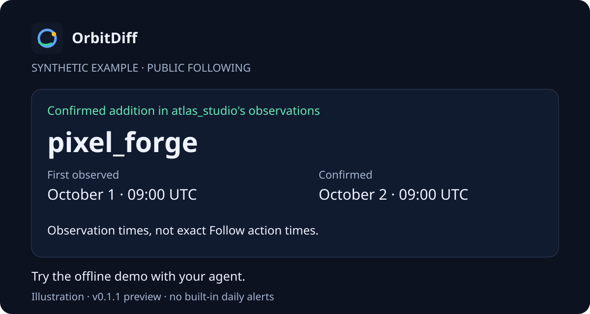

# OrbitDiff

## Who did they follow?

See which accounts appeared in someone's **public Instagram following list**, with dated observations your AI agent can explain.

Curious about a crush or partner's public follows? OrbitDiff keeps the result concrete: a handle, what changed, and when the change was observed. It cannot tell you why.



**Worked example, synthetic:** `atlas_studio` has a baseline on September 30. `pixel_forge` first appears on October 1 and is pending. Another accepted complete observation on October 2 agrees on that addition, so it becomes confirmed. These are observation dates, not the time someone tapped Follow.

## Try the offline demo with your agent

Paste the [setup prompt](docs/prompt.md) into a local coding agent that can run terminal commands. It checks prerequisites, preserves an existing installation, runs the synthetic demo and returns an offline receipt. It finishes before any live login or collection.

Prefer the terminal? With Python 3.11+, Git and pipx available:

```bash
pipx install git+https://github.com/deserteaglemj/orbitdiff.git@v0.1.1
orbitdiff demo
```

The demo needs no Instagram login and makes no Instagram request. It shows `baseline stored`, `pending changes observed`, and confirmed changes for synthetic `nova_labs` and `ember_lab`; timestamps vary. It uses a temporary database and preserves your existing history.

## Preview and verification state

This journey targets the **v0.1.1 public-following CLI and Agent Skill**. The runtime commands; the skill instructs. The published pin installs that release, including its published skill text. Local marketing edits are a candidate until separately published.

The offline demo exercises the comparison workflow. It does not prove live collection, host discovery, scheduled execution or notification delivery. This release has **no built-in daily alerts**. See the [claim ledger](docs/marketing/claim-ledger.md) and [candidate verification](docs/marketing/implementation-status.md).

Open the [28-second synthetic walkthrough](docs/marketing/assets/walkthrough.html) locally in a browser, or read its [accessible transcript](docs/marketing/assets/walkthrough.md). It is an illustration, not a live app screen.

## How confirmation works

| State | What it establishes |
|---|---|
| Baseline | First accepted complete observation is the starting point. No new-follow event. |
| Pending | One later accepted complete observation sees a changed relationship. |
| Confirmed | Another accepted complete observation agrees on that relationship change. Whole rosters need not match. |
| Gap | A failed or incomplete check does not update relationships. Existing evidence is retained. |

Accepted complete means provider iteration finished and the list passed validation, including at least 95% of the reported count. Exact roster coverage is not guaranteed. Confirmation is agreement between observations, not knowledge of every Follow action.

## Installation and live prerequisites

The offline route requires Python 3.11+, Git, pipx and terminal access. The optional skill placement route also needs GitHub CLI with `gh skill` support. Check `gh skill install --help`.

For a **user-selected Codex project**, the published skill placement command is:

```bash
gh skill install deserteaglemj/orbitdiff orbitdiff --pin v0.1.1 --agent codex --scope project
```

Choose the intended host and scope; preserve existing skills. Other host names are listed in CLI help. Placement is separate from actual host discovery and task execution. There is no universal agent compatibility or fixed setup-time guarantee.

Live use requires a separate opt-in, a specific public target and a human-created local Instaloader session. **Enter credentials only in your own terminal, never in agent chat.** The runtime dependency does not necessarily expose the login CLI on PATH. Follow [authentication](skills/orbitdiff/references/authentication.md) and the optional live section of the [setup prompt](docs/prompt.md).

## Limits and recovery

- Following lists only. Private profiles, followers, posts, stories, DMs and account actions are outside the product.
- History starts at baseline. Brief changes between checks can be missed. Observation times do not reveal exact action times.
- v0.1.1 has no explicit collection request/time bound or durable concurrent reservation. Keep at least 30 minutes after **every** live attempt, including baselines and failures; its runtime cooldown covers successful scans only. Avoid parallel collection.
- A session, challenge, rate-limit, private-target or completeness problem ends the attempt. Resolve it before another attempt; a gap never means nothing changed.
- SQLite history is local. Your chosen AI host handles shared output under its own settings. Local-first does not promise anonymity or undetectability.
- Public handles and changes do not establish identity, gender, motives, attraction or fidelity. Keep those unknown.

For setup help, capture the command, exit code and a redacted error. Consult the [setup guide](docs/prompt.md) and [security policy](SECURITY.md). Keep sessions and target data out of public issues. `doctor` checks and initializes storage, not authentication. `status` and `report` can also initialize a database; use the intended data path.

## Learn more

- [Who did they follow?](docs/marketing/content/who-did-they-follow.md)
- [When did they follow that account?](docs/marketing/content/observation-times.md)
- [Inspect following history with your agent](docs/marketing/content/agent-history.md)
- [Responsible scheduling guidance](skills/orbitdiff/references/scheduling.md)

Scheduling needs its own authorization and successful manual workflow. Machine availability and host configuration determine whether a later command runs. The guidance is not a built-in service or verified notification route.

## Command reference

```text
orbitdiff doctor [--data-dir PATH]
orbitdiff init PUBLIC_TARGET --login LOGIN_USERNAME [--session-file PATH] [--data-dir PATH]
orbitdiff scan PUBLIC_TARGET --login LOGIN_USERNAME [--session-file PATH] [--data-dir PATH]
orbitdiff status PUBLIC_TARGET [--data-dir PATH] [--json]
orbitdiff report PUBLIC_TARGET [--data-dir PATH] [--format json|markdown] [--output PATH]
orbitdiff demo [--data-dir PATH]
```

The human supplies references to local sessions, never their contents. Use the same data directory throughout a live workflow. Status `confirmed_count` counts confirmed-present relationships, not events. Exit codes: `0` success, `2` policy/session error, `3` incomplete collection/cooldown, `4` storage error.

## Contribute

See [CONTRIBUTING.md](CONTRIBUTING.md) and the [release checklist](docs/release-checklist.md). Share synthetic reproductions and help improve setup clarity. This project is not affiliated with Instagram or Meta. Respect applicable terms and law.

## License

MIT. See [LICENSE](LICENSE).
