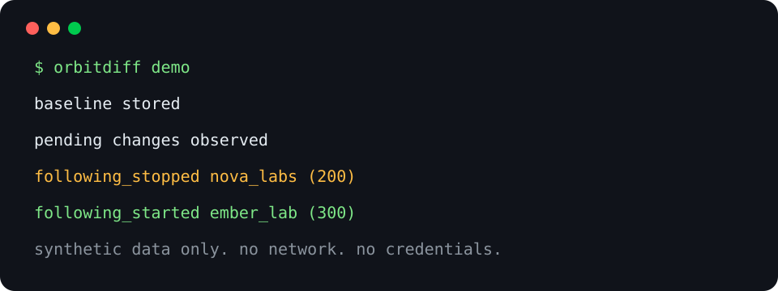

# OrbitDiff

**Track who enters and leaves any public Instagram orbit.**

OrbitDiff is a local-first CLI and Agent Skill for confirmed changes in a public Instagram following list. It stores a minimal SQLite history on your machine, requires two matching complete scans before reporting a change, and never asks for an Instagram password.



Run the offline demo first. It uses bundled synthetic accounts, makes no network request, and needs no credentials:

```bash
pipx install git+https://github.com/deserteaglemj/orbitdiff.git@v0.1.0
orbitdiff demo
```

## Why OrbitDiff

- **Local-first:** SQLite stays on your machine. No cloud account, telemetry, or remote database.
- **Public-only:** private targets are rejected before following-list collection.
- **Confirmed diffs:** incomplete scans fail closed and changes need two matching observations.

If the demo fits your workflow, star the repository so other researchers can find it.

## Install the Agent Skill

OrbitDiff ships a portable skill for GitHub Copilot, Claude Code, Cursor, Codex, and Gemini CLI. It teaches agents the public-only boundary, saved-session safety, completeness rules, and pending versus confirmed changes.

```bash
# Default GitHub Copilot host
gh skill install deserteaglemj/orbitdiff orbitdiff --pin v0.1.0 --scope user

# Claude Code
gh skill install deserteaglemj/orbitdiff orbitdiff --pin v0.1.0 --agent claude-code --scope user

# Cursor
gh skill install deserteaglemj/orbitdiff orbitdiff --pin v0.1.0 --agent cursor --scope user

# Codex
gh skill install deserteaglemj/orbitdiff orbitdiff --pin v0.1.0 --agent codex --scope user

# Gemini CLI
gh skill install deserteaglemj/orbitdiff orbitdiff --pin v0.1.0 --agent gemini-cli --scope user
```

The commands use GitHub CLI's `--pin` option. Inspect the tag before installation if you need a source review.

## Live workflow

OrbitDiff tracks public following lists only. It does not access private profiles, DMs, posts, stories, contact data, or account actions. It is not affiliated with Instagram or Meta. Follow applicable terms and law.

1. Check local readiness without contacting a target:

   ```bash
   orbitdiff doctor
   ```

2. Create a local Instaloader session in your own terminal. OrbitDiff never accepts a password, verification code, browser data, or raw session material:

   ```bash
   instaloader --login YOUR_INSTAGRAM_USERNAME
   ```

3. Create a silent baseline for a public target:

   ```bash
   orbitdiff init atlas_studio --login LOGIN_USERNAME
   ```

4. Scan later and view confirmed events:

   ```bash
   orbitdiff scan atlas_studio --login LOGIN_USERNAME
   orbitdiff status atlas_studio --json
   orbitdiff report atlas_studio --format markdown
   ```

OrbitDiff enforces a 30-minute per-target cooldown for live scans. It stops on a missing session, private target, provider failure, rate limit, or incomplete list.

## Pending versus confirmed

Suppose `atlas_studio` follows `pixel_forge` in the baseline. A later complete scan sees `nova_labs` instead. Both observations are pending. If the next complete scan sees the same list, OrbitDiff confirms:

```text
following_stopped pixel_forge
following_started nova_labs
```

A contradictory next scan clears the pending observation. A failed or below-95-percent collection leaves relationship state unchanged.

## Command reference

```text
orbitdiff doctor [--data-dir PATH]
orbitdiff init PUBLIC_TARGET --login LOGIN_USERNAME [--session-file PATH] [--data-dir PATH]
orbitdiff scan PUBLIC_TARGET --login LOGIN_USERNAME [--session-file PATH] [--data-dir PATH]
orbitdiff status PUBLIC_TARGET [--data-dir PATH] [--json]
orbitdiff report PUBLIC_TARGET [--data-dir PATH] [--format json|markdown] [--output PATH]
orbitdiff demo [--data-dir PATH]
```

Exit codes: `0` success, `2` policy or saved-session error, `3` incomplete collection or cooldown, `4` local storage error.

## Development

```bash
python -m pytest -q
ruff check .
mypy src
python -m build
```

See [CONTRIBUTING.md](CONTRIBUTING.md), [SECURITY.md](SECURITY.md), and the [release checklist](docs/release-checklist.md).

## License

MIT. See [LICENSE](LICENSE).
